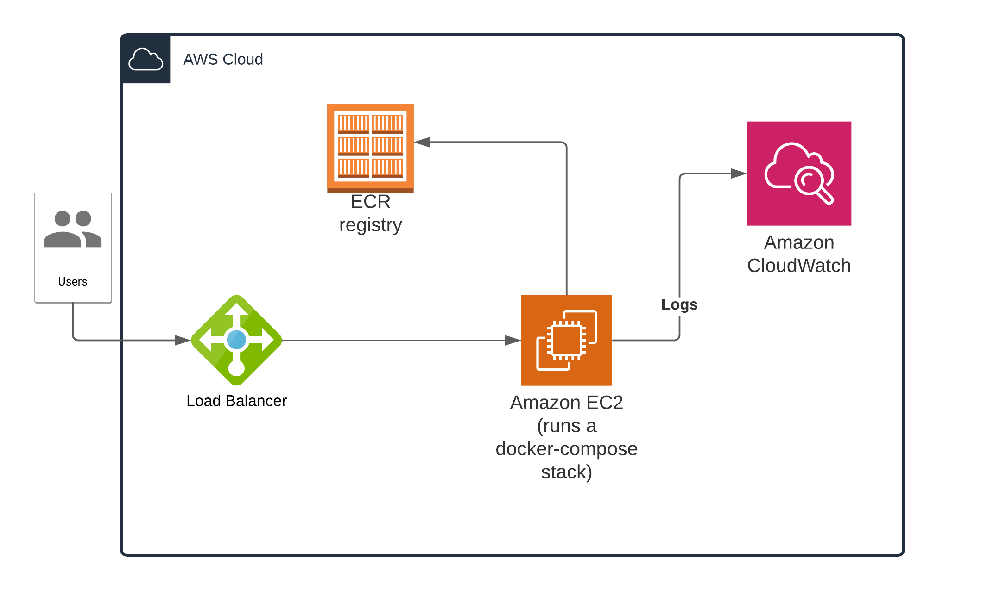

# Demo issuer mono repo

This is a monorepo contianing demo issuer POC. This monorepo is build into a docker compose stack with a nginx front end. Please refer to `docker-compose.yml` for details

Directories

```bash

├── nginx <--- Proxy for docker compose start point
├── terraform <--- Terraform scripts
├── fronend <--- React app issuer
└── api <--- Api to create VC

```

## Build

Make sure aws cli and profile is setup. <https://docs.aws.amazon.com/cli/latest/userguide/getting-started-install.html>.

All command are in `makefile`


### Commands Summary

Create ECR repos

```bash
make ecr
```

Run localhost

Run following command and navigate to `http://localhost`

```bash
make local
```

### Build and deploy to aws



Following command will create infrasturcture and deploy to aws.

Update Terraform Variables. `git_token` and `target_group_arn` should be updated if you are using a new loadbalancer.

Create a Key/Pair called `ec2_key` in aws console.

Update following env variables if your aws environment is different

```bash
export REGION
export ECR_REPO_URL
```

```bash
make ecr build deploy
```

Redeploy command if you want to redeploy services

```bash
make remotedeploy
```
